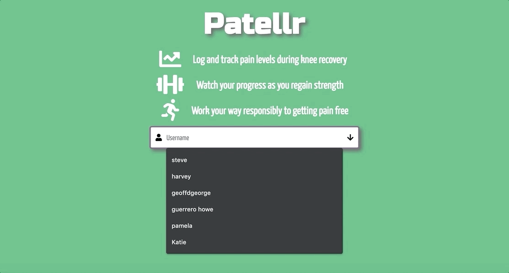
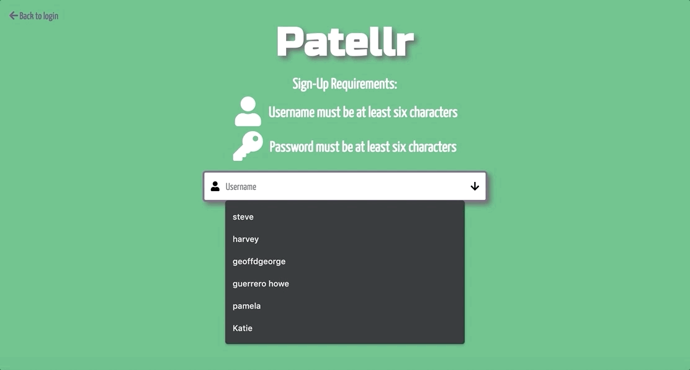

# **Patellr**

Patellr is a full-stack app built to track the progress of patients as they recover from knee pain. It's intended to help boost the morale of and set goals for those going through physical therapy, and it could also provide doctors and insurers with quantifiable data to determine next steps for care.

# Table of Contents

- ### [Dependencies](https://github.com/geoffdgeorge/Patellr/tree/master#dependencies-1)
  - ##### [Back End](https://github.com/geoffdgeorge/Patellr/tree/master#back-end-1)
  - ##### [Front End](https://github.com/geoffdgeorge/Patellr/tree/master#front-end-1)
- ### [How It Works](https://github.com/geoffdgeorge/Patellr/tree/master#how-it-works-1)
- ### [Future Plans](https://github.com/geoffdgeorge/Patellr/tree/master#future-plans-1)
  - ##### [Editing of User Entries](https://github.com/geoffdgeorge/Patellr/tree/master#editing-of-user-entries-1)
  - ##### [Progress Tracking for Other Body Parts](https://github.com/geoffdgeorge/Patellr/tree/master#progress-tracking-for-other-body-parts-1)
  - ##### [Password Resetting](https://github.com/geoffdgeorge/Patellr/tree/master#password-resetting-1)
  - ##### [Admin Access](https://github.com/geoffdgeorge/Patellr/tree/master#admin-access-1)

# Dependencies

## Back End

- [Sequelize](https://www.npmjs.com/package/sequelize) (to handle queries to the MySQL database)
- [Express](https://www.npmjs.com/package/express) (to handle basic routing on the back end)
- [Express Handlebars](https://www.npmjs.com/package/express-handlebars) (to tie our express routing to the Handlebars view engine)
- [Express Session](https://www.npmjs.com/package/express-session) (to help track user status from page visit to page visit)
- [Passport JS](https://www.npmjs.com/package/passport) (to handle authenticated routing on the back end)
- [bcrypt](https://www.npmjs.com/package/bcrypt) (to handle the hashing, salting, and decrypting of user passwords during authentication via Passport)

## Front End

- [Chart JS](https://www.npmjs.com/package/chart.js) (to chart out user data on a nice-looking line graph)
- [Moment JS](https://www.npmjs.com/package/moment) (to work with the formatting of timestamp data before it's printed to the chart)
- [Axios](https://www.npmjs.com/package/axios) (to make GET and POST requests to the server)

# How It Works

Front-end usability of Patellr is straightforward. A user either logs in from the login page or signs themselves up as a new user from the sign-up page. Thanks to Passport on the back end, each user's unique user page can only be accessed once the user has been authenticated. And, thanks to Express Session, once signed in, a user can navigate away from their user page and return without having to sign in twice.

Once a user is on the user page, their data (or lack of data, if they're visiting for the first time) appears instantly.

Then, they simply input their latest pain and strength levels (as well as the location of the pain) and submit it to update the page and see how their latest data fits with past updates.

If a user tries to login with an invalid username or password, or if they try to sign up with an existing username, they will return an error and be prompted to resubmit.

# Future Plans

## Editing of User Entries

The Patellr MVP appropriately and successfully logs each update for each user, but at the moment there's no option for a user to update an entry if they've misclicked. A future release of the site will provide appropriate controls on the front end and verified routing on the back end to allow for such updates.

## Progress Tracking for Other Body Parts

Knees aren't the only parts of the human anatomy that commonly need rehabilitation. Future versions of Patellr could track the location and severity of pain for the elbow, the hip, the lower back, and more.

## Password Resetting

Currently users cannot reset their passwords once they've created them. New authentication routing and new Passport strategies will need to be created for the hashing of new passwords for existing users.

## Admin Access

The current version of Patellr is built solely for patients, allowing them to update with their latest recovery progress. Eventually the app will include admin privileges for doctors or insurers needing access to all patient data, and a new admin page will be created to easily access that data.
